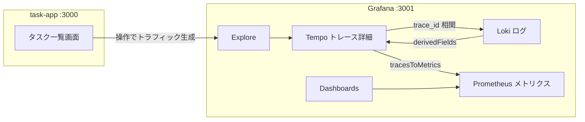

# 機能仕様書

画面ごとの機能詳細・画面遷移・UI/UX 方針を定義する。機能要件の一覧は [`02-requirements-specification.md`](./02-requirements-specification.md) を参照。

本プロジェクトは「監視基盤」が主役のため、UI は ① example アプリ（task-app）の最小画面 と ② Grafana 上の監視操作フロー の 2 系統で記述する。

## 目次

- [画面仕様](#画面仕様)
- [画面遷移](#画面遷移)
- [UI/UX 方針](#uiux-方針)

## 画面仕様

### タスク一覧画面（task-app `/`）

監視対象の example。単一ページで完結する。

- **表示項目**: タスク一覧（タイトル / 完了チェック / 削除ボタン）、新規追加フォーム（タイトル入力 + 追加ボタン）。
- **操作**:
  - 追加: フォームにタイトルを入力 → 追加 → `POST /api/tasks` → 一覧再取得。
  - 完了切替: 各行のチェックボックス → `PATCH /api/tasks/:id` → 当該行を更新。
  - 削除: 各行の削除ボタン → `DELETE /api/tasks/:id` → 当該行を除去。
- **バリデーション表示**: タイトル未入力時は追加ボタンを無効化、サーバー 400 時はエラーメッセージを表示。
- 各操作が HTTP リクエスト → サーバー API → DB クエリへと連なり、1 本のトレースとして観測される。

### Grafana 監視画面（`:3001`）

- **Explore（Tempo）**: 直近トレースを検索し、HTTP スパン配下に PostgreSQL スパンが連なる様子を確認。
- **Explore（Loki）**: `{service_name="task-app"}` でログを表示。各ログの `trace_id` から Tempo へジャンプ。
- **Explore（Prometheus）**: RED メトリクス（リクエスト率/レイテンシ/エラー率）やランタイム/コンテナ指標を確認。
- **Dashboards**: `app-red`（アプリの RED）, `containers`（cAdvisor/node-exporter）。

## 画面遷移

- task-app 内の遷移: 一覧画面のみ（追加/完了切替/削除は同一画面内で完結し、一覧を再描画）。
- 監視フロー: アプリ操作 → Grafana で Explore/Dashboard → トレース・ログ・メトリクス間を相互リンクでたどる。

## UI/UX 方針

### 全体方針

- example アプリは**監視の確認手段**であり、装飾より「操作するとテレメトリが出る」分かりやすさを優先する。
- 1 操作 = 1 リクエスト = 1 トレースが直感的に対応するよう、画面操作とサーバー処理を素直に対応させる。
- Grafana 側は**プロビジョニング済み**で起動し、ログイン後すぐ 3 本柱と相互リンクを体験できる状態にする。
- 対応環境・レスポンシブ等の非機能は [`04-non-functional-specification.md`](./04-non-functional-specification.md) を参照。
