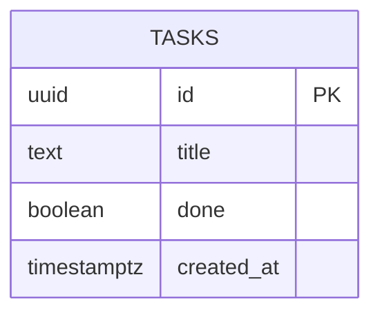
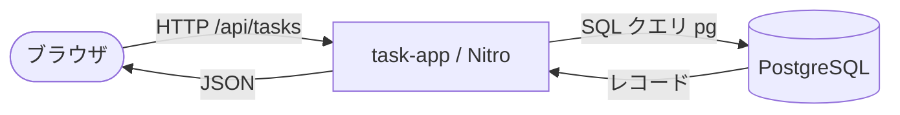
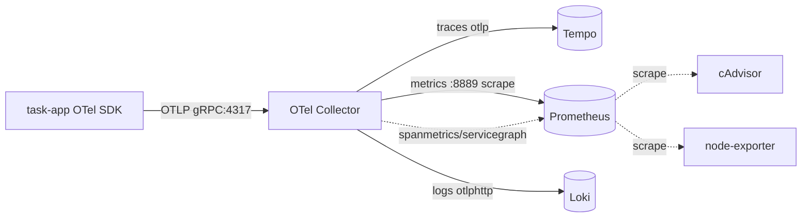

# データ仕様書

データモデルとスキーマを定義する。API のレスポンス形式は [`07-api-specification.md`](./07-api-specification.md) を参照。

本プロジェクトのデータは ① アプリの業務データ（`tasks`）と ② テレメトリデータ（トレース/メトリクス/ログ）に分かれる。後者はスキーマレスのため[データフロー](#データフロー)で扱う。

## 目次

- [エンティティ一覧](#エンティティ一覧)
- [ER 図](#er-図)
- [エンティティ詳細](#エンティティ詳細)
- [スキーマ定義](#スキーマ定義)
- [データフロー](#データフロー)

## エンティティ一覧

| エンティティ | 説明 |
|------|------|
| tasks | example タスク管理アプリのタスク 1 件。監視対象の業務データ |

## ER 図

単一エンティティ構成（example のため関連は持たない）。



## エンティティ詳細

### tasks

#### フィールド

| フィールド | 型 | 必須 | 説明 |
|-----------|----|----|------|
| id | uuid | ○ | 主キー。サーバー採番（`gen_random_uuid()`） |
| title | text | ○ | タスク名。空文字・空白のみ不可（アプリ側バリデーション） |
| done | boolean | ○ | 完了フラグ。既定 `false` |
| created_at | timestamptz | ○ | 作成日時。既定 `now()` |

API レスポンスでは `created_at` を `createdAt`（camelCase）として返す（[`07`](./07-api-specification.md) 参照）。

#### インデックス・制約

- `id` は主キー（一意）。
- `title` は `NOT NULL`。空白のみの拒否はアプリ層で実施（[`06`](./06-security-specification.md) 参照）。
- 並び順は `created_at` 昇順を既定とする。

## スキーマ定義

PostgreSQL の初期化スクリプト（`apps/task-app/db/init.sql`、コンテナの `docker-entrypoint-initdb.d` で適用）。

```sql
CREATE EXTENSION IF NOT EXISTS pgcrypto;  -- gen_random_uuid() 用

CREATE TABLE IF NOT EXISTS tasks (
    id          uuid        PRIMARY KEY DEFAULT gen_random_uuid(),
    title       text        NOT NULL,
    done        boolean     NOT NULL DEFAULT false,
    created_at  timestamptz NOT NULL DEFAULT now()
);
```

## データフロー

### 業務データ（tasks）



### テレメトリデータ（3 シグナル）

アプリは OTLP で Collector に送り、Collector が各バックエンドへ振り分ける。Collector はスパンから RED/サービスグラフメトリクスも生成する。



- **トレース**: HTTP スパン（自動計装）＋ PostgreSQL クエリスパン（`pg` 自動計装）。
- **メトリクス**: Node ランタイムメトリクス＋ Collector 生成の RED メトリクス、cAdvisor/node-exporter のコンテナ/ホスト指標。
- **ログ**: アプリが OTel Logs API で emit する構造化ログ。emit 時のアクティブスパンから `trace_id` が自動付与され、トレースと相関。
