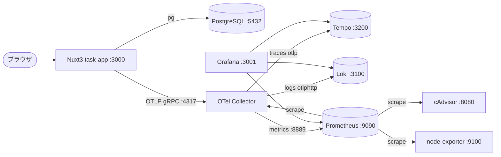

# アーキテクチャ仕様書

システム構成・技術スタック・インフラ・セットアップ手順を定義する。

## 目次

- [技術スタック](#技術スタック)
- [構成方針](#構成方針)
- [システム構成図](#システム構成図)
- [環境変数](#環境変数)
- [ローカル開発セットアップ](#ローカル開発セットアップ)
- [デプロイ](#デプロイ)
- [将来構成](#将来構成)

## 技術スタック

| レイヤー | 技術 |
|----------|------|
| モノレポ | pnpm workspaces（`apps/` + `infra/`） |
| example アプリ | Nuxt 3 / Nitro（サーバー API）/ Vue 3 |
| DB | PostgreSQL（`pg` ドライバ） |
| 計装 | OpenTelemetry JS SDK（traces/metrics/logs）、auto-instrumentations（http, pg）、ランタイムメトリクス、ログは OTel Logs API で直接 emit |
| 収集 | OpenTelemetry Collector（contrib。spanmetrics / servicegraph connector） |
| メトリクス | Prometheus |
| トレース | Grafana Tempo |
| ログ | Grafana Loki |
| 可視化 | Grafana（datasource/dashboard プロビジョニング） |
| インフラ指標 | cAdvisor（コンテナ）/ node-exporter（ホスト） |
| 実行基盤 | Docker / Docker Compose |
| テスト | Vitest + pg-mem |

## 構成方針

- **疎結合**: アプリは「OTLP を Collector に送る」契約のみ守る。バックエンド（Tempo/Loki/Prometheus/Grafana）はアプリに依存せず再利用可能。
- **収集の一元化**: 全シグナルを中央 Collector に集約し、ルーティング/加工（バッチ・属性処理・RED 生成）を一箇所に置く。
- **メトリクス経路の一本化**: スパン由来の RED/サービスグラフも Collector の connector で生成し、Prometheus に集約（Tempo の metrics-generator は使わない）。
- **ディレクトリ**: 監視対象は `apps/`、監視基盤の設定は `infra/`、起動は `docker-compose.yml`。

## システム構成図



トレース→ログ→メトリクスの相互リンク（trace_id 相関 / exemplar / サービスグラフ）を Grafana プロビジョニングで有効化する。

## 環境変数

`.env`（`.env.example` を複製）で管理。秘匿情報はクライアント（ブラウザ）へ露出しない。

| 変数 | 用途 | 参照箇所 |
|------|------|----------|
| `POSTGRES_USER` / `POSTGRES_PASSWORD` / `POSTGRES_DB` | PostgreSQL 初期化 | postgres / task-app |
| `PGHOST` / `PGPORT` / `PGUSER` / `PGPASSWORD` / `PGDATABASE` | task-app の DB 接続 | task-app（`server/utils/db.ts`） |
| `OTEL_EXPORTER_OTLP_ENDPOINT` | OTLP 送出先（既定 `http://otel-collector:4317`） | task-app（`instrumentation.mjs`） |
| `OTEL_SERVICE_NAME` | サービス名（既定 `task-app`） | task-app |
| `GF_SECURITY_ADMIN_USER` / `GF_SECURITY_ADMIN_PASSWORD` | Grafana 管理者（既定 admin/admin） | grafana |

> ポート一覧: task-app `3000` / Grafana `3001`(→3000) / Prometheus `9090` / Tempo `3200` / Loki `3100` / PostgreSQL `5432` / Collector `4317`(gRPC)・`4318`(HTTP)・`8889`(prom exporter)・`8888`(self) / cAdvisor `8080` / node-exporter `9100`。

## ローカル開発セットアップ

```bash
# 前提: Docker / Docker Compose / pnpm / Node.js 22
cp .env.example .env          # 環境変数を用意
pnpm install                  # 依存をインストール（ワークスペース）
docker compose up -d --build  # 全サービス起動
# → アプリ http://localhost:3000 / Grafana http://localhost:3001
pnpm test                     # テスト実行（task CRUD）
docker compose down -v        # 破棄（volume 含む）
```

## デプロイ

- 現状はローカル（Docker Compose）のみ。クラウドデプロイ・CI/CD はスコープ外。
- 将来 CI で `pnpm test` を実行する想定（[`08`](./08-test-specification.md)）。

## 将来構成（Web アプリ差し替え）

- example の task-app を本命 Web アプリに差し替える際は、**監視スタック（infra/ と compose のバックエンド群）は不変**。
- 新アプリ側で行うのは概ね以下のみ:
  1. OTel SDK を導入し `OTEL_EXPORTER_OTLP_ENDPOINT` を Collector に向ける。
  2. `OTEL_SERVICE_NAME` を新サービス名に設定（Grafana のサービスグラフ/RED に自動で現れる）。
  3. 必要なら Collector に処理（属性付与/フィルタ）やダッシュボードを追加。
